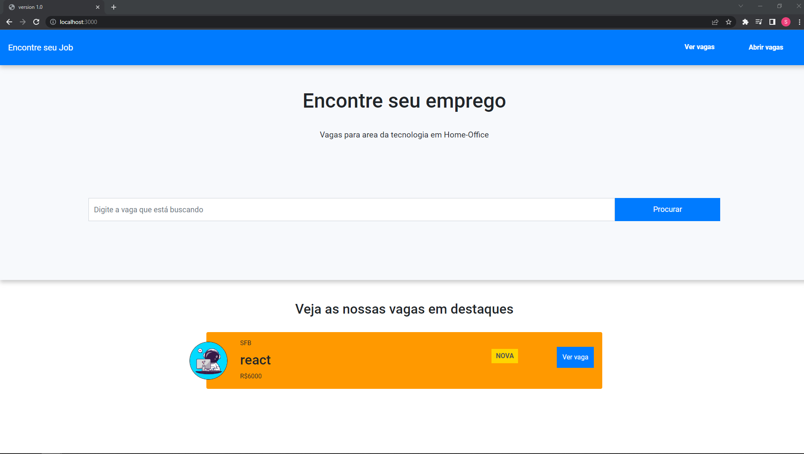
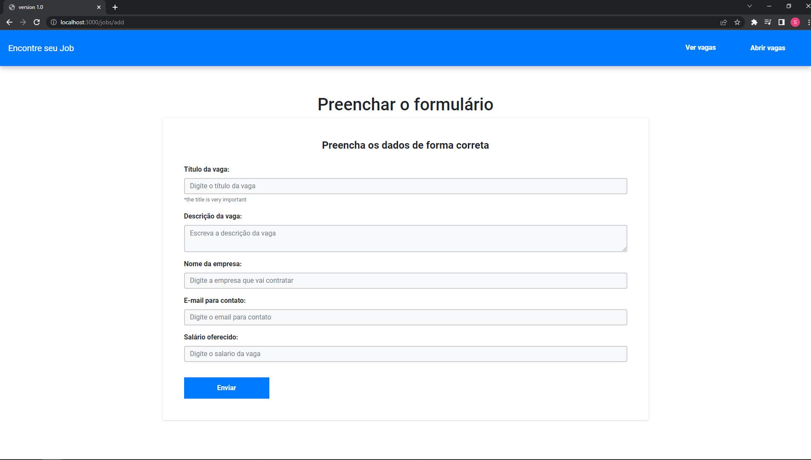
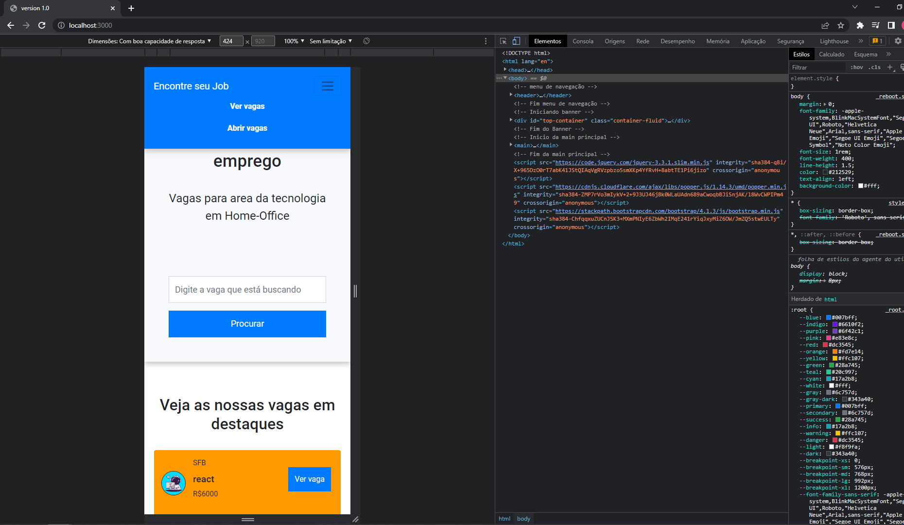
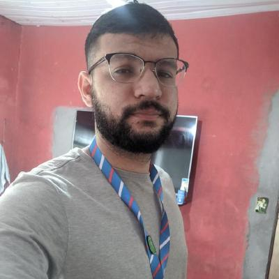

# Enconrtre seu job

> Resultado do projeto .

### Ajustes e melhorias

O projeto ainda está em desenvolvimento e as próximas atualizações serão voltadas nas seguintes tarefas:

- [x] Criação do HTML
- [x] Criação do CSS
- [x] Criação do RESPOSIVO
- [x] Node.js
- [x] Framework Express
- [x] Handlebars para renderização da pagina
- [x] Sequelize e SQLITE para banco de dados
- [ ] Crição de login para usuarios 

## 🤝 Colaboradores

Agradecemos às seguintes pessoas que contribuíram para este projeto:

<table>
  <tr>
    <td align="center">
      <a href="#">
         
        
          <b>Saraego Felix</b>
        
      </a>
    </td>
  
  </tr>
</table>
